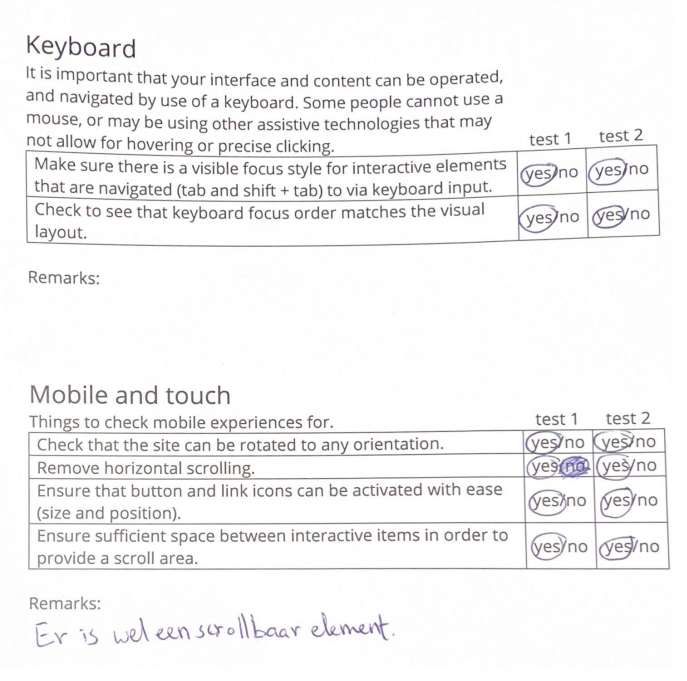

# Procesverslag
Markdown is een simpele manier om HTML te schrijven.  
Markdown cheat cheet: [Hulp bij het schrijven van Markdown](https://github.com/adam-p/markdown-here/wiki/Markdown-Cheatsheet).

Nb. De standaardstructuur en de spartaanse opmaak van de README.md zijn helemaal prima. Het gaat om de inhoud van je procesverslag. Besteedt de tijd voor pracht en praal aan je website.

Nb. Door *open* toe te voegen aan een *details* element kun je deze standaard open zetten. Fijn om dat steeds voor de relevante stuk(ken) te doen.

## Jij

  
uitwerken voor kick-off werkgroep

  ### Auteur:
  Nathalie Bakker

  #### Je startniveau:
  Blauw

  #### Je focus:
  Surface plane
 

## Je website

  
uitwerken voor kick-off werkgroep

  ### Je opdracht:
  <a href="https://www.c-and-a.com/nl/nl/shop/dames"> C&A website</a> 

  #### Screenshot(s) van de eerste pagina (small screen): 
    Dames overzicht 
  

  #### Screenshot(s) van de tweede pagina (small screen):
    Dames rokken
  
 

## Toegankelijkheidstest 1/2 (week 1)

  
uitwerken na test in 2e werkgroep

  ### Bevindingen
  Lijst met je bevindingen die in de test naar voren kwamen:
 
Test met kleurenbril #0779P
- De kleuren van de kleding zijn heel anders, paars lijkt grijs.
- Alles is duidelijk te zien behalve de kleuren.
- De teksten zijn duidelijk leesbaar

Test met combined loss diabetic eye disease bril
- Moeilijk om kleine tekstjes te lezen.
- Wat grotere teksten zijn wel goed te lezen.
- Plaatjes zijn redelijk goed te zien.
- Lastig om details te zien.
- Ze moet haar hoofd steeds draaien om de site te kunnen zien door de vlekken op de bril.

Screenreader test: 
- Bij dames pagina van heading level 1 naar 3 naar 2, geen logische structuur
- Bij dames pagina staat niet beschreven wat link van www.c-a.com/foryou is
- Bij links nu ontdekken en nu shoppen, weet je niet waar je naartoe wordt geleid.
- Er wordt te veel informatie opgelezen bij productlinks op de detailpagina.
- Koppeling wordt vaak meerdere keren opgelezen

Overige bevindingen:
- De hover states en focus states zijn niet goed vormgegeven. Het is namelijk bijna niet te zien wanneer je over een button heen hovered of op een button focust door tabben.
- De sluitknop in het hamburgermenu zit rechts, wat geen handige plek is aangezien de knop om het menu te openen links zit.
- De website heeft geen dark mode.
- De focus state bij de links is niet zo duidelijk, omdat er alleen een klein kringetje omheen komt te staan.

## Breakdownschets (week 1)

  
uitwerken na afloop 3e werkgroep

  ### de hele pagina: 
  
  

  ### dynamisch deel slideshow: 
  

  ### dynamisch deel uitklapmenu: 
  

## Voortgang 1 (week 2)

  
uitwerken voor 1e voortgang

    Op onderstaande afbeelding is te zien hoe mijn HTML structuur er uit zag.
    
    

    Op bovenstaande afbeelding is te zien hoe ik heb geoefend met typografie.
  

  ### Stand van zaken
  Deze week ben ik begonnen met het maken van de basis van mijn HTML. Dit ging best goed volgens mij. Ik vond het af en toe wel lastig om te bepalen of iets een section of een article was. 
  Verder heb ik alle oefeningen gemaakt. De oefening met het hamburgermenu vond ik wel lastig. Ik kwam best wel ver met de oefening, maar de laatste paar stappen lukten me helaas niet. Deze stappen wil ik       
  daarom met de docent bespreken tijdens mijn voortgangsgesprek.

  ### Agenda voor meeting
  samen met je groepje opstellen                          

  | Nathalie      | Sosan          | Fouzia    | |
  | ---            | ---                | ---          | ---              |
  | Hamburgermenu bespreken  | HTML laten checken             | Toegankelijkheid bespreken    |
 

  ### Verslag van meeting
  hier na afloop snel de uitkomsten van de meeting vastleggen

  - De laatste 2 stappen van de hamburgermenu opdracht heeft de docent aan mij uitgelegd.
  - De docent heeft mijn HTML structuur gecontroleerd en me tips gegeven om het beter te maken.
  - Ik heb meegekeken met de HTML structuren van de andere leerlingen.

## Voortgang 2 (week 3)

  
uitwerken voor 2e voortgang

  

  ### Stand van zaken
  hier dit ging goed & dit was lastig (neem ook screenshots op van delen van je website en code)
  Tijdens deze week ging het maken van het hamburgermenu in mijn eigen website best goed, aangezien ik hem werkend kreeg. Wel was er een plaatje wat over het menu heen ging. In de les heb ik toen aan de docent gevraag hoe ik het plaatje naar achteren moest krijgen. Dit bleek met z-index te moeten. Nu moet ik nog zorgen dat het menu knopje het C&A logo is i.p.v. een knopje met menu erin. 
      
      
   

  Ik wilde ook graag mijn plaatjes scrollbaar maken. Dit lukte me alleen nog niet tot dusver. Ik heb daarom in de les aan Donna gevraagd hoe ik dit het beste kan doen. Na haar tips was het me gelukkig wel gelukt. Later was ik ook nog bezig met het plaatsen van de tekst voor de plaatjes. Bij het eerste plaatje was dit me gelukt. Bij het tweede plaatje wilde de tekst helaas niet verder naar rechts dan het scherm breed was. Dit wil ik tijdens het voortgangsgesprek graag bespreken met 1 van de assistenten. 
  

 

  ### Agenda voor meeting
  samen met je groepje opstellen

  | Nathalie      | Sosan          | Fouzia    |        |
  | --            | ---                | ---          | ---              |
  | Vragen hoe ik een uitklapmenu kan maken  |  | HTML structuur laten nakijken   |     |
  | Vragen hoe ik tekst in scrollvak op de juiste plek krijg. |  |  |  |
  | Tekstvlak uit laten klappen |  |  |  |

  ### Verslag van meeting

  - Uiteindelijk hebben we de prioriteit gelegd bij het proberen te zorgen dat de tekst op de juiste plek in het scrollvak komt te staan. De student assistent zei dat ik mijn flexbox beter in een grid kon veranderen. Dit hadden we toen gedaan, maar het lukte niet om de plaatjes en teksten op de juiste plekken te krijgen. Toen het uur om was, stonden mijn tekst en plaatjes dus beide niet op de goede plek. 

 
## Toegankelijkheidstest 2/2 (week 4)

  
uitwerken na test in e werkgroep

  ### Bevindingen
  Lijst met je bevindingen die in de test naar voren kwamen (geef ook aan wat er verbeterd is):
  - De alt teksten zijn verbeterd, zodat het duidelijk is wat er gebeurt als je op een link klikt.
  - De heading levels zijn op de juiste manier gebruikt.
  - Alle afbeeldingen hebben nu een alt tekst die de afbeelding gedetailleerd beschrijft.
  - Er is een Aria hidden gebruikt voor het hamburgermenu, zodat deze niet wordt opgelezen door de screenreader.
  - Er is een dark mode gemaakt, zodat bezoekers van de site zelf kunnen bepalen in welke mode ze de website willen bekijken.
  - De sluitknop in het hamburgermenu is naar links verplaatst, zodat het menu makkelijk weg te klikken is. Het menu zelf wordt namelijk op diezelfde plek geopend, dus dan hoeft de gebruiker niet eerst weer met zijn/haar muis naar rechts om het menu te sluiten.
  - De focus state van de buttons is duidelijk verbeterd, want bij de C&A website is bij tabben bijna niet te zien wanneer je op een button staat.
  - De hover state van de buttons is duidelijk verbeterd, omdat de buttons een andere kleur krijgen wanneer er overheen wordt gehoverd. Bij de C&A website was bijna geen verschil te zien bij het hoveren over een button.
  - Bij de links onder het scrollvak op de detailpagina is bij tabben een verandering in de kleur van de link te zien. Dit maakt het duidelijker welke link geselecteerd is.
  - Het contrast van beide pagina's is goed volgens de contrast checker.

WCAG checklist

  
  
  
  
  

## Voortgang 3 (week 4)

  
uitwerken voor 3e voortgang

  ### Stand van zaken
  hier dit ging goed & dit was lastig
  
  Omdat het niet lukte met het juist positioneren van de tekst in de plaatjes heb ik een medestudent die heel goed is in coderen om hulp gevraagd. Hij zei dat ik de grid weer terug moest veranderen naar een flexbox. Ik heb alles toen weer veranderd naar de manier waarop ik het eerst had, zodat de plaatjes in ieder geval weer op de juiste plek stonden. Uiteindelijk bleek dat ik alleen was vergeten om mijn ul een position: relative te geven. Toen ik dit had gedaan stonden mijn teksten op de juiste plekken. 

  
  Verder heb ik afgelopen maandag 04-12 mijn tweede website pagina grotendeels gemaakt. Ik liep hierbij wel tegen wat kleine dingetjes aan, zoals elementen die niet naar de juiste plek wilden. Uiteindelijk heb ik dit gelukkig met de hulp van Donna op kunnen lossen. Ik had ook samen met haar gekeken naar mijn scrollbalken. Eerst wilde ik deze namelijk weghalen, maar zij vertelde me dat ik ze ook gewoon kon stylen. Dit had ze zelf ook nog nooit gedaan, maar we kwamen er gelukkig wel uit na even op Google te hebben gekeken.

  Ook ben ik deze week bezig geweest met het stylen van de focusstate van mijn buttons en links. Dit is het resultaat geworden.
  

  ### Agenda voor meeting
  samen met je groepje opstellen

  | Nathalie      | Sosan          | Fouzia    |         |
  | ---            | ---                | ---          | ---              |
  | Welke dingen ik kan toevoegen voor mijn surface plane.  | Voortgang bespreken             | Hamburgermenu bespreken    |    |
  | Of het goed is dat ik een figure heb gemaakt van een icoontje met tekst |  |  |  |
  | Tips vragen voor Dark mode            |                 |           |               |

  ### Verslag van meeting

  - Met de docent heb ik besproken wat de mogelijkheden waren voor de surface plane. Ik heb nu een goed beeld van wat ik wil doen voor de surface plane.
  - De docent vertelde me dat het niet zo erg is dat ik een figure heb gemaakt van het icoontje met de tekst. Wel vertelde hij dat een figure vaak eerder wordt gebruikt bij bijvoorbeeld statistieken.
  - De docent vertelde me dat ik met filter invert de icoontjes wit kon maken i.p.v. zwart. Eerst waren mijn icoontjes namelijk niet zichtbaar, omdat ze in de dark mode dezelfde kleur hadden als de achtergrond. 

## Eindgesprek (week 5)

  
uitwerken voor eindgesprek

Deze week heb ik me voornamelijk gefocust op de surface plane. Ik heb hiervoor de volgende dingen gemaakt:
- Darkmode
- Linear gradient
- Repeating-conic-gradient
- Repeating-radial-gradient
- Drop-shadows
- Animatie: in- en uitzoomen van logo, favorieten hartje en plaatjes in scrollblok.
- Animatie: ronddraaiende icoontjes
- Uitklapbaar menu
- Vormgegeven scrollbalken

  ### Je uitkomst - karakteristiek screenshots:
  Eindresultaat van de overzichtspagina
  
  

  Eindresultaat van de detailpagina
  
  

  ### Dit ging goed/Heb ik geleerd: 
  Het opmaken van de button met een repeating conic gradient en een box shadow ging goed en vond ik leuk om te doen. Het was handig dat we hier ook mee hebben geoefent in de les.
  
  

  Ik heb tijdens dit vak vooral geleerd om met flexbox te werken en om een uitklapmenu te maken. Voor dit vak vond ik werken met flexbox namelijk nog erg lastig en nu gaat dit veel beter.
  
  

  ### Dit was lastig/Is niet gelukt:
  Ik vond het scrollvak erg lastig om te maken, omdat ik eerst niet goed wist hoe ik het scrollbaar kon maken. Vervolgens lukte het niet om de tekst op de juiste plek te krijgen. Uiteindelijk is het gelukkig toch gelukt met wat hulp.
  
  

## Bronnenlijst

  1. W3Schools Online HTML Editor. (z.d.). https://www.w3schools.com/css/tryit.asp?filename=trycss_form_border2*/
  2. How can I style horizontal Scrollbar by CSS? (z.d.). Stack Overflow. https://stackoverflow.com/questions/44334106/how-can-i-style-horizontal-scrollbar-by-css*/
  3. CSS Hide all images with matching SRC attribute. (z.d.). Stack Overflow. https://stackoverflow.com/questions/6763899/css-hide-all-images-with-matching-src-attribute */

