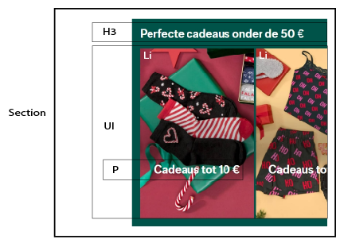

# Procesverslag
Markdown is een simpele manier om HTML te schrijven.  
Markdown cheat cheet: [Hulp bij het schrijven van Markdown](https://github.com/adam-p/markdown-here/wiki/Markdown-Cheatsheet).

Nb. De standaardstructuur en de spartaanse opmaak van de README.md zijn helemaal prima. Het gaat om de inhoud van je procesverslag. Besteedt de tijd voor pracht en praal aan je website.

Nb. Door *open* toe te voegen aan een *details* element kun je deze standaard open zetten. Fijn om dat steeds voor de relevante stuk(ken) te doen.

## Jij

  
uitwerken voor kick-off werkgroep

  ### Auteur:
  Nathalie Bakker

  #### Je startniveau:
  Blauw

  #### Je focus:
  Surface plane
 

## Je website

  
uitwerken voor kick-off werkgroep

  ### Je opdracht:
  <a href="https://www.c-and-a.com/nl/nl/shop/dames"> C&A website</a> 

  #### Screenshot(s) van de eerste pagina (small screen): 
    Dames overzicht 
  

  #### Screenshot(s) van de tweede pagina (small screen):
    Dames rokken
  
 

## Toegankelijkheidstest 1/2 (week 1)

  
uitwerken na test in 2e werkgroep

  ### Bevindingen
  Lijst met je bevindingen die in de test naar voren kwamen:
 
Test met kleurenbril #0779P
- De kleuren van de kleding zijn heel anders, paars lijkt grijs.
- Alles is duidelijk te zien behalve de kleuren.
- De teksten zijn duidelijk leesbaar

Test met combined loss diabetic eye disease bril
- Moeilijk om kleine tekstjes te lezen.
- Wat grotere teksten zijn wel goed te lezen.
- Plaatjes zijn redelijk goed te zien.
- Lastig om details te zien.
- Ze moet haar hoofd steeds draaien om de content goed te kunnen zien.

Screenreader test: 
- Bij dames pagina van heading level 1 naar 3 naar 2, geen logische structuur
- Bij dames pagina staat niet beschreven wat link van www.c-a.com/foryou is
- Bij links nu ontdekken en nu shoppen, weet je niet waar je naartoe wordt geleid.
- Er wordt te veel informatie opgelezen bij andere productlinks op detailpagina.
- Koppeling wordt vaak meerdere keren opgelezen

## Breakdownschets (week 1)

  
uitwerken na afloop 3e werkgroep

  ### de hele pagina: 
  
  

  ### dynamisch deel slideshow: 
  

  ### dynamisch deel uitklapmenu: 
  

## Voortgang 1 (week 2)

  
uitwerken voor 1e voortgang

  ### Stand van zaken
  hier dit ging goed & dit was lastig (neem ook screenshots op van delen van je website en code)
  De oefening met het hamburgermenu was lastig.

  ### Agenda voor meeting
  samen met je groepje opstellen

  | Nathalie                       | Sosan                  | Fouzia                         | student 4        |
  | Hamburgermenu bespreken        | HTML laten checken     | Toegankelijkheid bespreken     | ---              |
  | HTML structuur laten checken   | en dit                 |                                | en dan ik dat    |
  | en dat ook nog                 | dit als er tijd is     | nog een punt                   | dit wil ik zeker |
  | ...                            | ...                    | ...                            | ...              |

  ### Verslag van meeting
  hier na afloop snel de uitkomsten van de meeting vastleggen

  - punt 1
  - punt 2
  - nog een punt
  - ...

## Voortgang 2 (week 3)

  
uitwerken voor 2e voortgang

  ### Stand van zaken
  hier dit ging goed & dit was lastig (neem ook screenshots op van delen van je website en code)

  ### Agenda voor meeting
  samen met je groepje opstellen

  | student 1      | student 2          | student 3    | student 4        |
  | ---            | ---                | ---          | ---              |
  | dit bespreken  | en dit             | en ik dit    | en dan ik dat    |
  | en dat ook nog | dit als er tijd is | nog een punt | dit wil ik zeker |
  | ...            | ...                | ...          | ...              |

  ### Verslag van meeting
  hier na afloop snel de uitkomsten van de meeting vastleggen

  - punt 1
  - punt 2
  - nog een punt
- ...

## Toegankelijkheidstest 2/2 (week 4)

  
uitwerken na test in 9e werkgroep

  ### Bevindingen
  Lijst met je bevindingen die in de test naar voren kwamen (geef ook aan wat er verbeterd is):

## Voortgang 3 (week 4)

  
uitwerken voor 3e voortgang

  ### Stand van zaken
  hier dit ging goed & dit was lastig (neem ook screenshots op van delen van je website en code)

  ### Agenda voor meeting
  samen met je groepje opstellen

  | student 1      | student 2          | student 3    | student 4        |
  | ---            | ---                | ---          | ---              |
  | dit bespreken  | en dit             | en ik dit    | en dan ik dat    |
  | en dat ook nog | dit als er tijd is | nog een punt | dit wil ik zeker |
  | ...            | ...                | ...          | ...              |

  ### Verslag van meeting
  hier na afloop snel de uitkomsten van de meeting vastleggen

  - punt 1
  - punt 2
  - nog een punt
  - ...

## Eindgesprek (week 5)

  
uitwerken voor eindgesprek

  ### Je uitkomst - karakteristiek screenshots:
  

  ### Dit ging goed/Heb ik geleerd: 
  Korte omschrijving met plaatjes

  

  ### Dit was lastig/Is niet gelukt:
  Korte omschrijving met plaatjes

  

## Bronnenlijst

  
continu bijhouden terwijl je werkt

  Nb. Wees specifiek ('css-tricks' als bron is bijv. niet specifiek genoeg). 
  Nb. ChatGpT en andere AI horen er ook bij.
  Nb. Vermeld de bronnen ook in je code.

  1. bron 1
  2. bron 2
  3. ...

